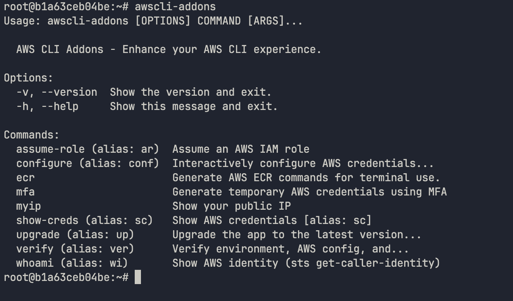

<h1 align="center">🚀 AWSCLI-Addons</h1>
<p align="center">High-performance CLI utilities to extend and simplify AWS workflows</p>

<p align="center">
  <a href="https://github.com/MaksymLeus/awscli-addons/releases">
    
  </a>
  <a href="https://github.com/MaksymLeus/awscli-addons/actions/workflows/ci.yml">
    
  </a>
  <a href="https://github.com/MaksymLeus/awscli-addons/releases">
    
  </a>
  <a href="LICENSE">
    
  </a>
</p>

<p align="center">
  
  
</p>

<p align="center">
  A collection of high-performance, standalone CLI utilities designed to extend and simplify your daily AWS workflows. These tools bridge the gap between complex <code>aws cli</code> commands and common developer tasks like MFA authentication, role assumption, ECR management, and identity verification.
</p>




## 🛠️ Features
This suite adds specialized commands to your toolkit (with built-in shorthand aliases!):

* **`whoami`** (`wi`): Quickly identifies the current IAM identity, account ID, and region.
* **`mfa`**: Streamlines the generation of temporary session tokens using a multi-factor authentication device.
* **`assume-role`** (`ar`): Simplifies switching between AWS accounts and IAM roles.
* **`show-creds`** (`sc`): View your active AWS credentials (with options to export or reveal secrets).
* **`configure`** (`conf`): Interactively configure AWS credentials and settings.
* **`myip`**: Instantly retrieves your current public IP address (crucial for updating Security Group ingress rules).
* **`verify`** (`ver`): Validates your current credentials and connection to ensure your environment is cloud-ready.
* **`ecr`**: A suite of subcommands to generate Docker/Helm login commands and manage repositories.
* **`upgrade`** (`up`): Seamlessly update the CLI to the latest version.

## 📂 Project Structure
```txt
awscli-addons
├── Dockerfile              # Container definition for consistent environments
├── awscli_addons/          # Main Python source package
│   ├── cli.py              # Application entry point & command routing
│   ├── commands/           # Logic for individual CLI subcommands
│   └── utils/              # Internal helper modules
│       └── aws_config.py   # shared logic for parsing ~/.aws files
├── docs/                   # Detailed documentation suite
│   ├── CONFIGURATION.md    # Guide for AWS profiles & aliases
│   ├── DEPLOYMENT.md       # Binary compilation & release info
│   ├── DEVELOPMENT.md      # Setup guide for contributors
│   ├── KUBERNETES.md       # Pod/CronJob & IRSA usage (Recommended)
│   ├── OVERVIEW.md         # Technical architecture deep-dive
│   └── TODO.md             # Project roadmap & pending tasks
├── pyproject.toml          # Modern Python build config & dependencies
└── tools/                  # Automation and distribution scripts
    ├── build.sh            # Script to compile standalone binaries
    └── installer.sh        # One-line installation & alias setup script
```

## 🚀 Installation

### Instant Install (Recommended)

Use our hosted installer to automatically detect your OS and Architecture.

| Mode | Command |
| :---: | --- |
| **Auto** | `curl -sSL https://raw.githubusercontent.com/MaksymLeus/awscli-addons/main/tools/installer.sh \| bash` |
| **Force Binary**	| `curl -sSL https://raw.githubusercontent.com/MaksymLeus/awscli-addons/main/tools/installer.sh \| BINARY_CMD=true bash` | 
| **Force Python**	| `curl -sSL https://raw.githubusercontent.com/MaksymLeus/awscli-addons/main/tools/installer.sh \| PYTHON_ONLY=true bash` |

*Prerequisites: `git` and `python 3.11+` (for Python mode).*

**Install a Specific Version:**

```bash
curl -sSL https://raw.githubusercontent.com/MaksymLeus/awscli-addons/main/tools/installer.sh | VERSION=v1.1.2 bash
```

### Manual Installation

Download the appropriate binary for your platform from the [`Releases page`](https://github.com/MaksymLeus/awscli-addons/releases):

```bash
# Example for Linux AMD64
wget https://github.com/MaksymLeus/awscli-addons/releases/download/${VERSION}/awscli-addons-linux-amd64
chmod +x awscli-addons-linux-amd64
sudo mv awscli-addons-linux-amd64 /usr/local/bin/awscli-addons

```

## 📖 Usage
Once installed, use the commands directly or via the native AWS CLI integration.

### Direct Usage
```bash
# Check your current identity using the alias 'wi'
awscli-addons wi

# Generate MFA session for a specific profile
awscli-addons mfa --profile default --mfa-code 123456 

# View AWS credentials for the current session
awscli-addons sc --reveal

# Generate ECR Docker login command
awscli-addons ecr login --profile my-profile
```

### Power User: Native AWS CLI Integration
The installer **automatically** configures an AWS CLI alias for you. If you install the official AWS CLI after these addons, the integration will be ready to use.

It adds a persistent alias to your **`~/.aws/cli/alias`** configuration, mapping **`aws addons`** directly to your `awscli-addons` binary.

```bash
# Use it like a native AWS command
aws addons whoami
aws addons mfa
aws addons myip
```

##  🔨 Development & Building

To build the project from source or add new commands:

1. Install dependencies:
   ```bash
   pip install .
   ```
2. Add a command:

	Create a new `.py` file in `awscli_addons/commands/` and register it in `cli.py`.

3. Build standalone binaries:
	
	```bash
	./tools/build.sh
	```
## Docker
Run the tools inside a container:

```bash
# Interactive identity check
docker run --rm -v ~/.aws:/root/.aws awscli-addons whoami

# Drop into a shell inside the container
docker run --rm -it --entrypoint bash awscli-addons
```
## Kubernetes 
Use the addons for debugging or automation inside your cluster.

```bash
# Bypass entrypoint to reach bash
kubectl run aws-debug -it --rm --image=your-repo/awscli-addons:latest --command -- /bin/bash

# Run identity check directly
kubectl run aws-check --rm -it --image=your-repo/awscli-addons:latest -- wi
```

## 📚 Documentation

For more detailed information, please refer to the `docs/` directory:

| Document           | Purpose                                 |
| ------------------ | --------------------------------------- |
| [`OVERVIEW.md`](docs/OVERVIEW.md) | Architecture and command reference. |
| [`CONFIGURATION.md`](docs/CONFIGURATION.md) | Tool setup and AWS profile management.  |
| [`DEPLOYMENT.md`](docs/DEPLOYMENT.md) | Binary compilation and distribution.    |
| [`DEVELOPMENT.md`](docs/DEVELOPMENT.md) | Guide for contributing and building from source. |
| [`TODO.md`](docs/TODO.md) | Roadmap & planned improvements. |

## Contributing
1. Fork the repository
2. Create a feature branch (`git checkout -b feature/amazing-feature`)
3. Commit your changes (`git commit -m 'feat: Add amazing feature'`)
4. Push to the branch (`git push origin feature/amazing-feature`)
5. Open a [Pull request](https://github.com/MaksymLeus/awscli-addons/pulls)
   
See [`docs/DEVELOPMENT.md`](docs/DEVELOPMENT.md) for development setup.

## 📄 License
MIT License — see [`LICENSE.md`](LICENSE.md) for details.

## Support

- [GitHub Issues](https://github.com/MaksymLeus/awscli-addons/issues)